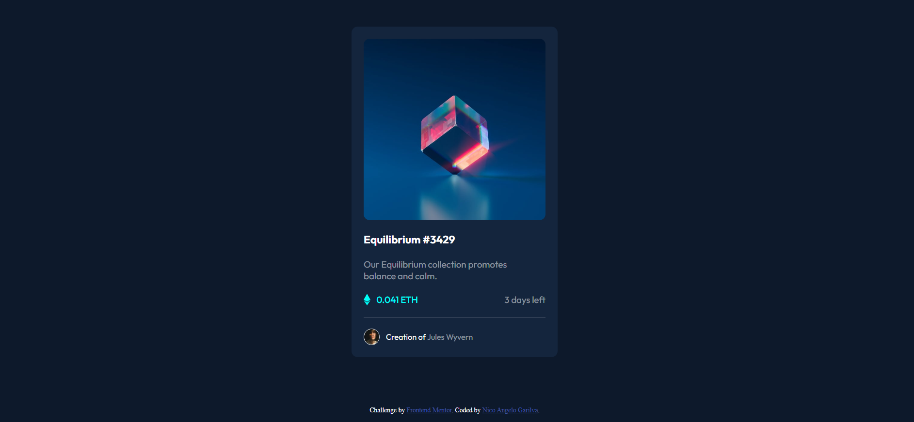
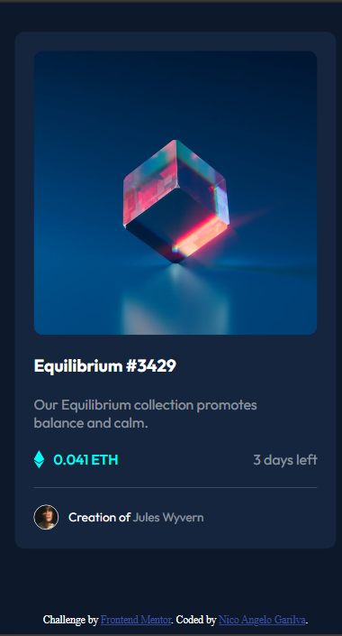
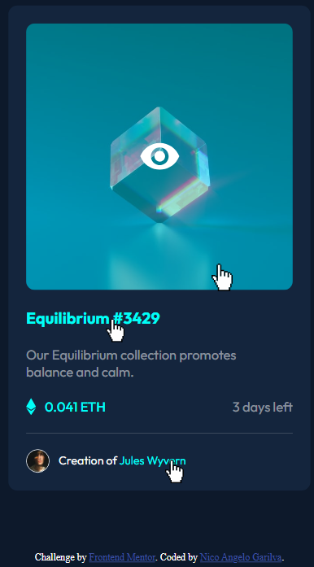

🖼️ NFT Preview Card Component

This is a solution to the NFT Preview Card Component challenge from Frontend Mentor
.
The project focuses on building a responsive and interactive card UI using HTML and CSS.

📸 Screenshot

🚀 Live Demo
[NFT Live](https://nico-devstudio.github.io/nft-preview-card/)

🛠️ Built With
Semantic HTML5
CSS3 (Flexbox, positioning)
Google Fonts (Outfit)
Hover effects & transitions

🎯 Features
Responsive NFT card layout
Hover overlay effect on image
Smooth hover transitions
Clean and minimal UI design
Modern dark theme styling

🧠 What I Learned
How to create image hover overlays using position: absolute
Better structuring of card components
Improving spacing and layout consistency with Flexbox
Using transitions to enhance UI interactivity
Writing cleaner semantic HTML
